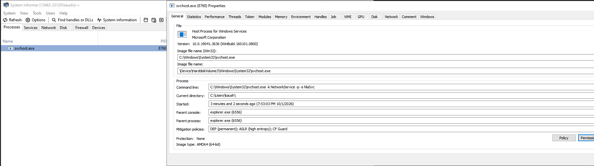

# Process Disguise - Kernel-Level Process Masquerading

A Windows kernel-mode driver and user-mode client that disguises any process as `svchost.exe` at the kernel level, making it appear legitimate in system monitoring tools like Task Manager, Process Explorer,System Informer and other security software.



## 🔍 Overview

**Process Disguise** operates at the Windows kernel level to modify internal process structures, making a target process completely masquerade as the legitimate Windows Service Host (`svchost.exe`). This goes beyond simple name spoofing - it modifies:

- Process image file name
- Full process path
- File objects and device objects
- Security tokens and SIDs
- Process Environment Block (PEB)
- Command line arguments
- Module list entries
- Memory characteristics
- Session ID

#### 1. **IRP Filtering Hook**
The driver installs a hook on `ZwQuerySystemInformation` to intercept system queries:

```
User-Mode Tool (Task Manager, Process Explorer, etc.)
         ↓
    ZwQuerySystemInformation (hooked)
         ↓
    Driver Filter (modifies process list)
         ↓
    Returns modified information
```

When any application queries the system for process information, the driver intercepts the request and modifies the returned data to show the disguised process as `svchost.exe`.

#### 2. **EPROCESS Structure Modification**
The driver directly manipulates the kernel `EPROCESS` structure:

- **ImageFileName** - Changed to `svchost.exe`
- **SeAuditProcessCreationInfo** - Full path redirected to `C:\Windows\System32\svchost.exe`
- **FileObject** - Swapped with a real svchost.exe file object
- **SectionObject** - Updated to match svchost.exe sections

#### 3. **PEB (Process Environment Block) Manipulation**
The driver attaches to the target process context and modifies its PEB:

```cpp
// Fake command line injected
C:\Windows\System32\svchost.exe -k NetworkService -p -s NlaSvc
```

This makes the process appear to be hosting the **NlaSvc (Network Location Awareness)** service, a legitimate Windows service.

#### 4. **Token and SID Replacement**
Security identifiers and access tokens are copied from a real `svchost.exe` process, making the disguised process inherit the same security context.

#### 5. **Module List Deception**
The loader data table entries in the PEB are modified so even deep inspection tools see `svchost.exe` as the main module.

### Filter Flow Diagram

```
Target Process (e.g., malware.exe PID 1234)
         ↓
User executes: ProcessDisguiseUM.exe
         ↓
Sends IOCTL to driver with PID 1234
         ↓
Kernel Driver:
  1. Find real svchost.exe process
  2. Copy its characteristics
  3. Modify EPROCESS structures
  4. Replace ImageFileName
  5. Swap FileObjects
  6. Modify PEB structures
  7. Replace tokens/SIDs
  8. Install IRP filter
         ↓
Result: Process 1234 now appears as svchost.exe
         ↓
System monitoring tools → see svchost.exe
```

## 📸 Visual Demonstration

As shown in `image.png`, the disguised process appears completely legitimate in system information tools. The process is displayed with:
- Name: `svchost.exe`
- Path: `C:\Windows\System32\svchost.exe`
- Command line: `svchost.exe -k NetworkService -p -s NlaSvc`
- Legitimate Windows service appearance

## 🔬 Technical Details

### Files

| File | Purpose |
|------|---------|
| `ProcessDisguiseDriverKM.cpp` | Main driver entry point, IRP handling, IOCTL interface |
| `ProcessDisguiseKM.cpp` | Core disguise logic, EPROCESS manipulation |
| `ProcessDisguiseKM.h` | Kernel structures and function declarations |
| `ProcessDisguiseUM.cpp` | User-mode client for sending disguise requests |

Discord - Cool.axez

